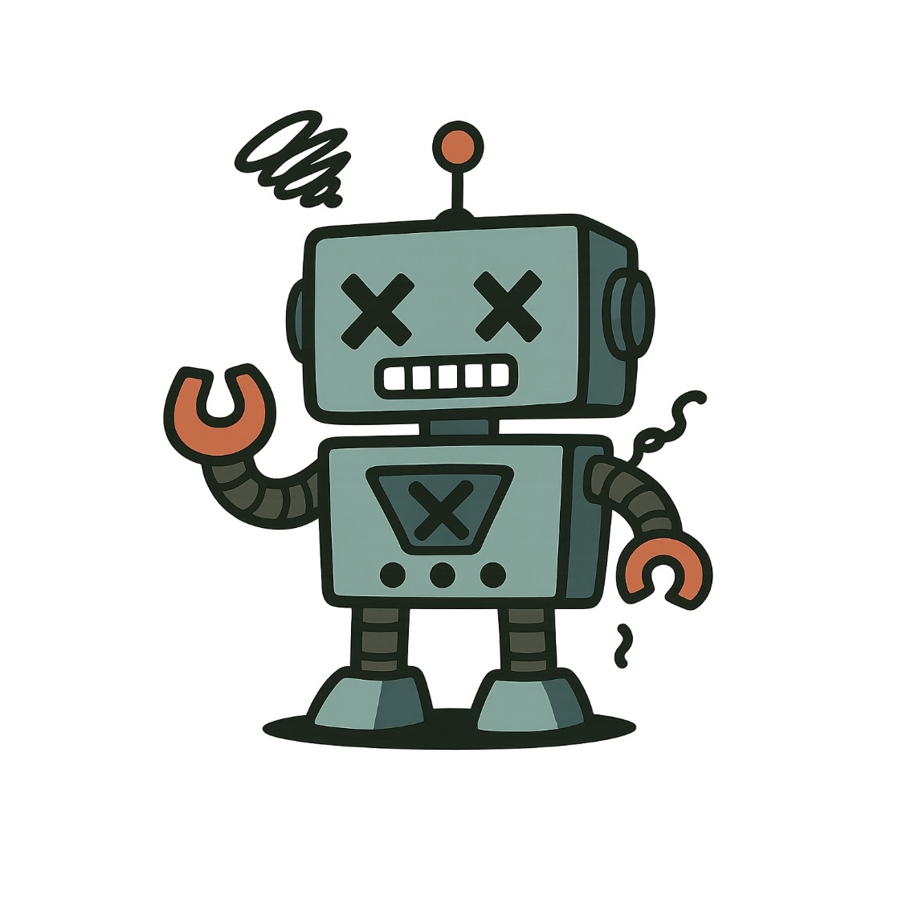

<!-- _class: cover -->

# 地味に効く、ドキュメント作成の AI 活用術

<style scoped>
  .profile-icon {
    width: 90px;
    float: left;
    margin-right: 16px;
  }
</style>



### ムツミックス / Mutsumix

<br />

2025-06-19 | 生成 AI と働く— エンジニア現場でのリアルな活用方法

<!--  -->

<!-- <https://slides.su8.run/250330-glt06> -->

---

<!--
header: 地味に効く、ドキュメント作成のAI活用術 | Mutsumix
-->

<!--
footer: 2025-06-19 | 生成 AI と働く— エンジニア現場でのリアルな活用方法
-->

<style scoped>
  .profile-icon {
    width: 400px;
    float: right;
    margin-right: -20px;
    margin-top: -20px;
  }
</style>


# 自己紹介

## 梶原 睦 / かじはら むつみ

- 株式会社 シスマック
  DX ソリューション事業部 部長

- Twitter: [@Mutsumix_dev](https://x.com/Mutsumix_dev)
- Voicy: [Mutsumix の進捗どう？](https://voicy.jp/channel/818315)
- エンジニア（8 年）
- 最近は受託開発の提案やったり営業やったり研修講師やったり総務やったり

---

<style scoped>
  section {
    background: #ebf8ff;
  }
</style>


## 北大生による、北大生のための時間割アプリ

---


---


---

## シラバスを検索できる

→ シラバスを取ってくる必要がある

---


---


---

```python
from collections import deque

from viewstate import ViewState

def parse_viewstate(encoded_viewstate):
    vs = ViewState(encoded_viewstate)
    data = vs.decode()

    # TODO: 本当にひどいのでなんとかしたい。。。
    classinfo = data[0][1][1][1][1][1][1][3][1][1][1][1][1]
    baseinfo = classinfo[3][1][1][1][1][1][1][1]

    for i in range(len(baseinfo) // 2):
        if not (baseinfo[2 * i + 1][0] is None) and False in baseinfo[2 * i + 1][0]:
            continue
        arraylist = baseinfo[2 * i + 1][1]

        (略)

    return data
```

---

## VIEWSTATE があまりに曲者

なんですが、使わないといけない理由もある

---

- Hupass では授業の主キーを自分たちで採番している
- スクレイピングごとにシラバス側を正として上書きしている

→ 判別するためのキーとして**時間割番号が必要**！！！

---

## なんですが

---

普通に検索すると時間割番号が出てこない（なんで？？）

---

なので、どうにかうまく付き合う方法を考えながら

インデックスアクセスを続けています

---

おわり
