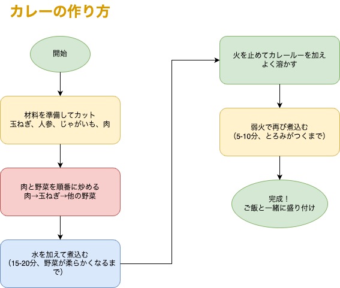

<!-- _class: cover -->

# 地味に効く、ドキュメント作成の AI 活用術

<style scoped>
  .profile-icon {
    width: 90px;
    float: left;
    margin-right: 16px;
  }
</style>


### ムツミックス / Mutsumix

<br />

2025-06-19 | 生成 AI と働く— エンジニア現場でのリアルな活用方法

<!--  -->

<!-- <https://slides.su8.run/250330-glt06> -->

---

<!--
footer: 地味に効く、ドキュメント作成のAI活用術 | Mutsumix
-->

<style scoped>
  .profile-icon {
    width: 400px;
    float: right;
    margin-right: -20px;
    margin-top: -20px;
  }
</style>


# 自己紹介

## 梶原 睦 / かじはら むつみ

- 株式会社 シスマック
  DX ソリューション事業部 部長

- Twitter: [@Mutsumix_dev](https://x.com/Mutsumix_dev)
- Voicy: [Mutsumix の進捗どう？](https://voicy.jp/channel/818315)
- エンジニア（8 年）
- 最近は受託開発の提案やったり営業やったり研修講師やったり総務やったり

---

<!-- _class: section-title -->

# コードは AI に任せられるようになりました

---

<!-- _class: section-title -->

# 開発ドキュメントは？

---

<div class="balloon-right">WordとExcelで設計書作ってる...
</div>

<br><br>


<div class="balloon-left">
PowerPointでAWS構成図描いてる...
</div>
<br><br>
<div class="balloon-right">ドキュメント修正のたび、図の修正も...
</div>


---

# 従来ドキュメントの問題点

**バージョン管理不可**（Fix*画面設計書*最終\_本当に最終.docx）

**コードと別の場所にある**（メンテコスト、陳腐化リスク増大）

**コンテキストスイッチ**（VSCode → PowerPoint → Word → VSCode）

##  <div class="balloon-left">図を描くのに 3 時間かかった...</div>

## 仕事した気になってしまうが、ビジネスは何も進んでいない

---

# AI 時代、ドキュメントは Markdown 記法で<br>書くことが一般化する

と勝手に予想。文章を構造化して表現できるので、意図を適切に AI に汲み取らせやすい

## 現状：

README.md、Notion、Slack、Zenn、Qiita、GitHub Issues

## 今後：

設計書、仕様書、議事録、マニュアル、提案書

---

# 特に作図を含むドキュメントは脳への負担が大きい

- **レイアウト**を考える
- **色**を選ぶ
- **アイコン**を探す
- **線を綺麗に整える**
- **文字サイズ**を調整
- **修正が入るたびに微調整**

---

# そこで提案 💡

## **Markdown** + **Cursor** + **Claude** + **draw.io 拡張**

- すべて一つのエディタで完結
- AI が図も文章も生成
- Git でバージョン管理
- コードと同じ場所に保管

---

# 実演 🎬

Terraform コードから構成図を生成

```hcl
resource "aws_vpc" "demo_vpc" {
  cidr_block           = "10.0.0.0/16"
  enable_dns_hostnames = true
  enable_dns_support   = true
}
resource "aws_instance" "web_server" {
  ami                    = data.aws_ami.amazon_linux.id
  instance_type          = "t3.micro"
  subnet_id              = aws_subnet.private_subnet_1.id
  vpc_security_group_ids = [aws_security_group.web_sg.id]
}
# ... 以下、省略（全381行）
```

---

## 指示文

「この Terraform コードを元に、AWS 構成図を.drawio ファイルで作成してください。AWS のアイコンを利用してください。」

---

<!--  -->

## 結果

<!-- <div style="text-align: center;">
  
</div> -->

---

## 待っている間に

<div style="text-align: center;">
  
</div>

---

## さらなるメリット

- **図の修正も一瞬**（AI に再指示するだけ）
- **多言語対応も簡単**（翻訳 AI と連携）
- **検索性抜群**（テキストベース）
- **チーム共有簡単**（GitHub/GitLab）

---

<!-- _class: section-title -->

# ありがとうございました 🙏
