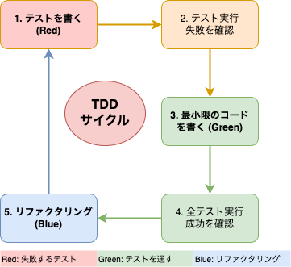
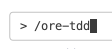
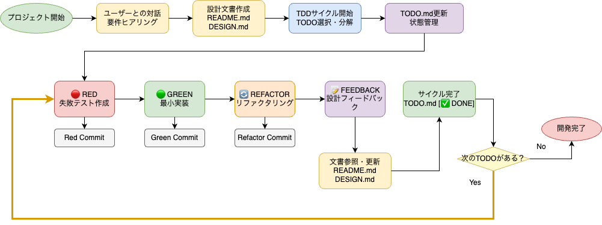

<!-- _class: cover -->

<!-- ## AI コードチェックが面倒すぎるのでテスト駆動開発で解決しようとして読んだら、根本的に俺の勘違いだった

## 読書シェア会 vol.7 -->


---
<style scoped>
  .profile-icon {
    width: 400px;
    float: right;
    margin-right: -20px;
    margin-top: -20px;
  }
</style>


# 自己紹介

## 梶原 睦 / かじはら むつみ

- 株式会社 シスマック
  DX ソリューション事業部 部長

- Twitter（現 X）: [@Mutsumix_dev](https://x.com/Mutsumix_dev)
- Voicy: [Mutsumix の進捗どう？](https://voicy.jp/channel/818315)
- 技術書典: [自宅水耕栽培で毎日サラダ生活](https://techbookfest.org/organization/dZMXNJTxsAx1K1pwDsU0iA)
- 最近は受託開発の提案やったり営業やったり研修講師やったり総務やったり

---
<!-- _class: section-title -->

# AI コーディング、やってますか？

---

<!--
footer: 読書シェア会 vol.7 | AI コードチェックが面倒すぎるのでテスト駆動開発で解決しようとして読んだら、根本的に俺の勘違いだった
-->

# AI コーディング、やってますか？

- AIにコード書かせる
- チャット形式でのコーディング補助からCLIやIDE統合を使った実装が今や主流
- 任せられる範囲は広がり、人間の方がCopilot（副操縦士）になっていく
- 人間の役割はコーディング結果のチェック
- めちゃくちゃ楽になってるはずだけど...

---

# AI コーディングの現実

- 自走させると最初は順調
- だんだん方向性がずれてくる
- 気づいたら修正不可能な状態

---

# 何か良い方法はないものか？

- 目 Grep は面倒だし...
- 成果物に対してテストをさせれば、ずれを修正できるのでは？
- よし、AI にテストを書かせよう

### プロンプト：

```
まずテストを書いて、それを突破するように実装して
```

---

# 結果

AI「テスト完了しました！🎯」

```javascript
describe("UserService", () => {
  it("should create user", () => {
    const mockDb = jest.fn();
    const mockValidator = jest.fn();
    // TODO: implement this test
    expect(true).toBe(true); // とりあえず通る
  });
});
```
- モックだらけ、都合悪いところがコメントアウトされている、何をテストしているか意味不明
- **こんなの受け入れていいのか？？**

---

<!-- _class: section-title -->

# AIにテストをさせる方法自体は悪くないはずだ

---

<!-- _class: section-title -->

# テストについての本を読もう

---

# ケント・ベック『テスト駆動開発』


## 「テストについてちゃんと学んで、効果的なテストの書き方を学ぶぞ」

### **3 部構成：**

- 第 1 部：テスト駆動開発（TDD）を使った実装
  - ある金融システムの多国通貨対応
- 第 2 部：xUnit の例
  - テスティングフレームワーク構築
- 第 3 部：TDDパターンとリファクタリングについて


<!-- **レッド・グリーン・リファクタサイクル** -->

---

# 印象に残ったページ
> 「テスト駆動開発は、プログラミング中の不安をコントロールする手法だ。...
> - 不安はためらいを生む。
> - 不安はコミュニケーションを減らす。
> - 不安はフィードバックから逃げ腰にさせる。
> - 不安はイライラさせる。
 
### わかる


--- 
<br><br>

> TDDはテスト技法ではない。 TDDは分析技法であり、設計技法であり、実際には開発の全てのアクティビティを構造化する技法なのだ。

> TDD においてテストは目的を達成するための手段であり、その目的は、大いなる自信を伴うコードだ。

###  TDDは品質担保にとどまらず、開発者の不安を軽減する開発手法のことらしい
---

# テスト駆動開発の流れ



<br>

1. まずはテストを一つ書く
2. 全てのテストを走らせ、新しいテストの失敗を確認する
3. 小さな変更を行う
4. 全てのテストを走らせ、全て成功することを確認する
5. リファクタリングを行なって重複を除去する

---

# 読んでみた結果

## 「あれ、これテストの書き方の本じゃない...？」

## **TDD の本質：**

- ❌ テスト設計手法
- ⭕ **プログラミング中の不安を取り除く開発手法**


---


# TDD の真の価値
## 核心は **心理的安全性**

- 小さなステップで確実に前進
- 常に動作するコードを維持
- 複雑さをコントロール
- プログラミング中の開発者の**不安を軽減**

---
<!-- _class: section-title -->

# 根本的に俺の勘違いだった

---
# 根本的な勘違いに気づいた

## Before (勘違い)

- **問題：** AI コードのチェックが面倒
- **試み：** AI にテストを書かせる → **失敗**
- **期待：** テストで品質担保

## After (理解)

- **実際の TDD：** 開発プロセス自体の改善
---

<!-- _class: section-title -->

# これからのAIコーディングへの応用可能性は？

---

# 最近のKent Beck氏のポッドキャストでの発言

> 「開発者の役割は、コードを書く人から、AIに良いコードとは何かを教える人へと変わっている。テストがその教育プログラムなのだ。」

https://newsletter.pragmaticengineer.com/p/tdd-ai-agents-and-coding-with-kent

---

# TDDの翻訳者、和田卓人（t-wada）さんの発言

> - Vibe Coding をはじめとした AIの開発生産性により、開発規模が大きくなると発生する諸問題が、ごく短期間で発生するようになった
> - 問題の構造は変わらず、顕在化までの時間が圧倒的に短くなっただけ
> - 仕様や設計を見つけるよくしていく過程がTDD
> - 細部を作りながら、全体の設計にフィードバックしていく過程が重要

[AI時代のソフトウェア開発を考える（2025/07版）](https://speakerdeck.com/twada/agentic-software-engineering-findy-2025-07-edition)

---
# TDD を AI コーディングに応用するなら

## ❌ 間違ったアプローチ

<br><br>

```
いい感じにテストを作って
```

## とAIに指示
- 指示する本人も何をテストされるかよくわからない

---

## ⭕ 正しいアプローチ

```
「タスクを小さな実装に分解 → 逐次消化 → リファクタリング」
```
## とAIに指示
- 方向性のずれを小さなうちに修正
- ゴールに向けた一歩ずつの前進
- 最初から大きななゴールを目指さないアプローチ **（バイブコーディングの醍醐味は失われるが）**

---

# 実際のプロンプト例

```
1. 最終ゴールを明確にする: 
    要件ヒアリングと設計文書（README.md、DESIGN.md）作成
2. 現在の状態から次の小さなステップを定義: 
    TODO.mdで進行状況確認し、作業対象を決定
3. そのステップだけを実装: 
    RED（失敗テスト）→GREEN（最小実装）→REFACTOR（改善）を順次実行
4. 動作確認: 
    各段階でテスト実行とコミットによる確認
5. 次のTODOを提示: 
    FEEDBACK段階で設計文書更新と新しいタスクの発見・追加
6. 2-5を繰り返し: 
```
---

# 実際のプロンプト例
### Claude Code のカスタムスラッシュコマンドとして登録してみた



Mutsumix/ore-tdd.md
https://gist.github.com/Mutsumix/75a6c162d83580ad6b9d1b134892213d

---

# サイクルの図解



---

# 学んだこと + 次のアクション

### **学んだこと**

- TDD は「テスト手法」ではなく開発者の不安を軽減する開発手法
- AIコーディング にもこの開発プロセスを適用できる可能性
- 読む前の思い込みに気をつける
  - 自分の理解を超えた優れた概念はまだまだある

### **次のアクション**

- この手法で実際にプロジェクトを試して効果を検証
- xUnit の実装の章を書籍に従って写経
- 『ソフトウェアエンジニアリング』を読む
  - 継続的にソフトウェアを開発していくための考え方を学ぶ

---

<!-- _class: cover -->

## ありがとうございました！

<!-- **質問・ディスカッションをお待ちしています**

Twitter や GitHub でも気軽にお声かけください
[@your_handle] -->

<!-- 最後に独り言

バイブコーディングの「寝てる間に良いコードができていた」は人間にとって甘い誘惑
しかし、一番重要なことを AI に任せると、その人はAIに代替される人材に自らなりにいっているようなもの
AIとは添い寝をするのではなく対話をする。自分の能力を拡張してくれる存在と捉える -->

<!-- おまけ
今回のスライドの作成自体も、AI の支援を受けた
書籍を読もうとしたきっかけ
書籍を読んで何を得たか
これから何をしたいか -->


<!-- 
スピーカーのーと
**著者の思考をトレースしたような進め方で、まるでケントベックの隣に座ってペアプログラミングしているような気分になれる**

まずはドキュメントを書く
README.mdにプロジェクトの概要を書く
DESIGN.mdに設計を書く
TODO.mdにTODOリストを書く

メソッド単位のタスクに分解
テストを作成する
実装


Red Green Refactoring commit 繰り返し
README.md, DESIGN.md, TODO.md を更新

細かくコミットをする、ドキュメントを残し適宜参照させることで、AIの記憶喪失（コンテキストウィンドウ切れ）を防ぐ

既存のコードを修正する場合はまた違ったアプローチ -->
