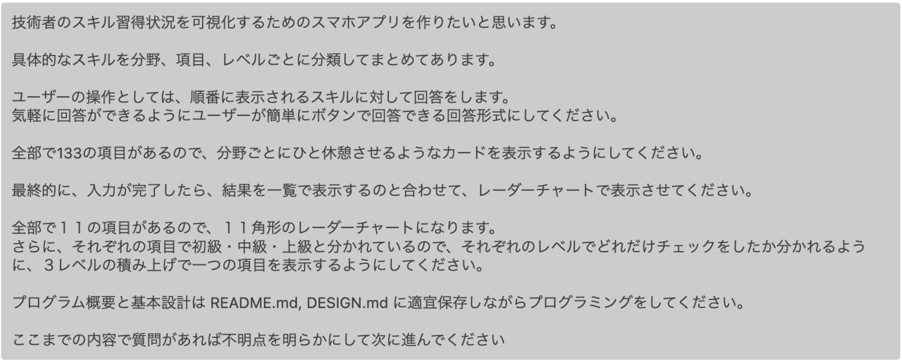

<!-- _class: cover -->

## 社員のスキルチェックのためにスマホアプリを作った話

### 2025 年 8 月 29 日 - 沖縄モバイルアプリ開発勉強会 #5

---

<style scoped>
  .profile-icon {
    width: 400px;
    float: right;
    margin-right: -20px;
    margin-top: -20px;
  }
</style>


# 自己紹介

## 梶原 睦 / かじはら むつみ

- 株式会社 シスマック
  DX ソリューション事業部 部長

- Twitter（現 X）: [@Mutsumix_dev](https://x.com/Mutsumix_dev)
- Voicy: [Mutsumix の進捗どう？](https://voicy.jp/channel/818315)
- 技術書典: [自宅水耕栽培で毎日サラダ生活](https://techbookfest.org/organization/dZMXNJTxsAx1K1pwDsU0iA)
- 最近は受託開発の提案やったり営業やったり研修講師やったり総務やったり
- オフィスがある関係で沖縄には月一ペースで来てます

---

# こんなアプリ作りました


---

<!-- _class: section-title -->

# アプリ作成のきっかけ

---

<!--
footer: 沖縄モバイルアプリ開発勉強会 #5 | 社員のスキルチェックのためにスマホアプリを作った話
-->

# 社員の技術を把握したい

- **プロジェクトのアサイン先を決める材料に必要**
  - ほとんどのエンジニアは SES（技術者派遣）で社内にいない
  - ヒアリングするかスキルシート書いてもらうまで保有スキルがわからない
- **目標設定と達成度の振り返りを定期的に行いたい**
  - スキルアップして欲しい
  - そのためにも自分のスキルを正確に把握して欲しい
  - **自分のスキルを棚卸しすることで気づきを得る機会を与えたい**

---

<!-- _class: section-title -->

# 解決策の検討

---

# スキルチェックの項目を作成した ✅

## 分野ごと・レベルごとに分類したスキルを 128 項目作成

## これを社員に回答してもらうことにした


---

# さて、やり方は？

## 案 1. エクセル・スプレッドシート配って回答

- ライセンスを持っていない社員がいる

## 案 2. Google フォームなどのアンケート形式で回答

- 途中保存ができない
- 戻って回答が難しい

---

# 💡 スマホアプリを作れば良いのでは？

## 🎯 ユーザー体験が良い

- 単調で作業感のある回答方式で社員に負担だと思って欲しくない

## 🏢 IT 企業っぽい

- 表計算ソフトである Excel になんでもかんでもやらせることへの違和感
- Excel で回答するセキュリティチェックシート見るたびにイライラする
- 自社肯定感を高めたい

<!--  - 実は一番重要視してたのはこれだったりします -->

<!-- ---

# 開発経験あり

## **React Native で不動産会社向けスマホアプリを作成した経験あり** -->

<!--  -->

<!-- <style scoped>
  .image-bottom {
    width: 60%;
    position: absolute;
    bottom: 0;
    padding-bottom: 50px;
  }
</style>

 -->

<!-- この時は実証実験止まりで結局リリースはされませんでした -->

---

<!-- _class: section-title -->

# デモンストレーション

---

# 技術スタック

## **Expo（React Native）**

- クロスプラットフォーム開発可能な React Native のビルドやデバッグ作業を効率化できるフレームワーク

## **TypeScript**

- 安全性と開発効率性を高める

<!-- JavaScriptのスーパーセットであるTypeScriptは、静的型付けと最新のECMAScript機能を提供します。これにより、コードの品質を向上させ、バグを早期に検出し、より良い開発者体験を提供します。さらに、TypeScriptは大規模なコードベースの管理を容易にし、リファクタリングを安全に行うことができます。 -->


---

# Expo の良い点

## 🚀 実機での確認が早くて簡単

ターミナルに表示される QR をスマホで読み込むだけで確認ができる

```Java
 // このコマンドを打つだけでOK
npx expo start
```

## 📱 リリース管理の簡素化

リリースにまつわる iOS, Android の証明書の管理とかを担ってくれる

---

# Expo の良い点（続き）

## ☁️ ビルドが簡単

### ビルドをクラウド上でやってくれる

### ローカルマシンの環境整備不要：Android Studio, Xcode がいらない

### マシンスペックがそんなに問われない

## 開発に集中できる

アプリ開発の開発以外の詰まりどころを肩代わりしてくれるので、**込み入った処理をしない限りは**開発に集中できる

<!-- UXにこだわりたい時、Bluetoothを使いたい時 -->

---

<!-- _class: section-title -->

# 実際の開発

---

# 開発は AI まかせ

<!-- ### 経験ベース

React Native で不動産会社向けスマホアプリを作成した経験あり -->

## AI ツールの活用

- **最初のリリースまで**: Cursor のエージェントモードで作成
- **その後の追加修正**: Claude Code
- 深い理由はなく、Claude Code の話題についていくために途中で乗り換えた

---

# 工夫したポイント

## 📝 ドキュメント整備

- **README.md**: アプリの概要
- **DESIGN.md**: 設計方針

常に参照・更新させるようにした

## 🔄 細かいコミット単位

commit 単位も細かくするようにし、参照点を増やした

---

## 実際のプロンプト



---

# リリースまでの流れ

### **５月：最初のプロトタイプ作成**

- 社内勉強会のテーマが AI エージェント活用だった。
- ちょうど良いと思いデモとして作成したものが意外とうまく作れた

### **５月〜６月：隙間時間で開発〜リリース準備**

- Apple 側 で「機能が少なすぎ」と言う理由でリジェクト、Google はゆるい印象
- 一時保存機能、前回との差分表示機能追加
- スクショアップロードしたりなんやりの審査にかけた作業がめんどくさい
- **リリース準備は AI に代替できないスキルかもしれない（2025 年 8 月時点）**

### **６月：リリース**

<!-- ## iOS/Android のアプリ開発者画面からアプリをリリースするまでの手順
**is めんどくさい**
- スクショのアップロード
- 年齢制限や広告の有無などの各種設定
- リジェクトされた場合の対応
品質の担保のためにプラットフォーマーがここを簡素化することはないと思う
**AI に代替できないスキル（2025 年 8 月時点）** -->

---

<!-- _class: section-title -->

# まとめ

---

<!-- _class: metric-card -->

# 会社のアプリをつくって得られた気づき

<br><br><br><br>

### 👥 **使ってくれる人からのフィードバックをもらいやすい、ありがたい**

### 🔄 **自分のやる気がなくなっても定期的に使われるので改善のきっかけが生まれる**

### 🔥 **会社の課題を技術で解決することは大きなモチベーションになる**

---

<!-- _class: section-title -->

# よかったら使ってみてください！

## **「技術マップ」でダウンロード可能（AppStore, Google Play）**

<!-- # ソフトウェアエンジニアリングの重要性

AI によって、開発効率・生産性は大幅に高まっていると同時に、ソフトウェア開発が抱える困難さに直面するタイミングが早まった（AI が生成するコードの品質の問題ではない）

「何書かれているかわからないからメンテできない」

## いかに変更に対して柔軟でスケールしやすい形で開発を継続していくかという**ソフトウェアエンジニアリング**の手法を身につけることの重要性が増している

## 一人のエンジニアに対する負荷は確実に高まる。それを面白がるか辛いとみるか 🤢 -->

<!-- 死にそうです -->

---

<!-- _class: cover -->

## ありがとうございました！
