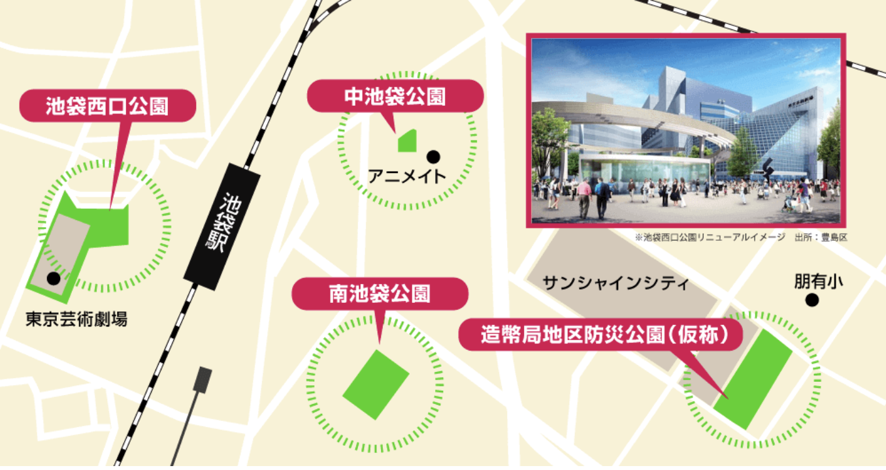

<!-- _class: cover -->

# 地域コミュニティを活かす 市民開発の可能性

### 発表者: ムツミックス
#### 日付: 2025-09-22

<!-- 
本日は貴重なお時間をいただき、ありがとうございます。
豊島区在住のエンジニアとして、地域の変革を技術と市民参加の視点から考察します。
約10分でお話しします。
-->

---

# 今日話す内容

1. 消滅可能性都市からの変革
2. 公園を核にした持続的なまちづくり  
3. 文化政策による都市ブランディング
5. 市民開発による地域活性化提案

<!-- 
消滅可能性都市から国際アート・カルチャー都市への変革を追い、
最終的に市民開発の可能性に焦点を当てます
-->

---

<!-- _class: section-title -->

# 豊島区の変革：2014年からの転換

---

<!-- _class: metric-card -->

## 2014年：危機からの出発点

### **消滅可能性都市の定義**
- 2010年から2040年までの30年間で、20〜39歳の若年女性人口が50%以上減少すると推計される自治体

**消滅可能性都市指定**
- 23区で唯一の指定

**新しい都市像の策定**
- 2015年に国際アート・カルチャー都市構想策定
- **公園を核にした持続的なまちづくり**

<!-- 
2014年の衝撃的な指定が、豊島区の大きな転換点となりました。
この危機感が、後の積極的な政策展開の原動力となります。
-->

---

<!-- _class: section-title -->

# 公園を核にした持続的なまちづくり

---

<!-- _class: comparison-matrix -->

## 4つの公園の整備と機能分担

| 公園名 | 主要機能 | 特徴 | 開園・更新 |
| ---- | ---- | ---- | ---- |
| 池袋西口公園 | 野外劇場 | 大型ビジョン・音響 | 2019年 |
| 中池袋公園 | イベント広場 | アニメ連携 | 2019年 |
| 南池袋公園 | 日常利用 | 芝生・カフェ | 2016年 |
| IKE・SUNPARK | 防災拠点 | 1.7ha | 2020年 |

<!-- 
各公園が明確な役割分担をして、面的なネットワークを形成しています。
豊島区は23区最小クラスの公園面積という制約を、質の向上で補っています。
-->

---

<!-- _class: metric-card -->

## 南池袋公園の成功モデル

**リニューアル効果**
- 開園：2016年4月
- 面積：7,811.5㎡
- 運営時間：8:00-22:00
- 芝生×カフェが特徴

**区の負担なしでの公園運営**
- 管理費等の年間経費（約3800万円）に豊島区の負担がない
- 変電所（東京電力）の占用料（約1,520万円）
- 地下鉄（東京メトロ）の占用料　（約350万円）
- 建物使用料 固定分（約1,230万円）
- 建物使用料 歩合分（約700万円）

<!-- 
南池袋公園は、公共空間の新しい使い方を示すモデルケースとなりました。
-->

---

<!-- _class: section-title -->

# 文化政策による都市ブランディング

---

## 文化資源の戦略的活用

### トキワ荘
- 手塚治虫ら輩出
- トキワ荘マンガミュージアムがある

### 乙女ロード
- サンシャインに面した通りにK-BOOKS, 同人館、コンカフェが軒を連ねる

### 区がバックアップする形で文化振興
- 池袋ハロウィンコスプレフェスを豊島区が共催
- 区民センターにアニメイトが隣接し、周辺には劇場・映画館が多数オープン
    - 目の前の中池袋公園は「痛バッグ」を掲げた腐女子がグッズ・情報交換の場になっている

<!-- 
既存の文化資源を区が積極的に支援・発信することで、
地域の個性とブランド価値を向上させています。
-->

---

## 個人的視点から見た池袋の特徴

### **公共とコミュニティ活動によるまちづくり**

- **CCC（Cleanup & Coffee Club）**
    - 多世代多種多様な地域の人が早朝に集まり、周辺をゴミ拾い。その後コーヒーを飲み交流する活動のこと
    - コロナ禍に始まり、現在日本中に「のれんわけ」され、CCCの活動が広まっている

- **ひがいけぽんど**
    - IKE・SUNPARK近くにある日替わりのポップアップスペース
    - 「まちのインディーズ・レーベル」をコンセプトに雑貨屋、お菓子屋、八百屋、本屋など、個人店主の出店が中心

### **公共的空間と雑多な空間が同居している**

- 整備されたとされる南池袋公園、中池袋公園周辺には未だにラブホテルが多い

---

<!-- _class: section-title -->

# 市民開発による地域活性化の提案

---

<!-- _class: strategy-grid -->

## 文化×市民開発アプリのアイディア（AI）

### **創る人を支える**
- **Tokiwa-Route**: 創作学習ルート案内
- **パブリック・ショーケース**: 公園での展示・上演申請システム
- **クリエイター×学校マッチング**: 地域連携支援

### **楽しむ人を回遊化**
- **Otome Finder**: 乙女ロード混雑・イベント情報
- **Cosplayモード**: 池袋ハロウィン期間の総合案内
- **Hareza Now**: 文化施設横断プログラム表示

<!-- 
文化活動の「する側」と「見る側」の両方を技術でサポートします。
-->

---

## 公園×市民開発アプリのアイディア（AI）

### パーク混雑ライト
- 4公園の滞在密度
- 分散来園促進

### 日陰ナビ
- WBGT（熱さ指数）×日射×風
- ベンチ空き状況
- 快適スポット提案**

### 非常時ナビ  
- 応急給水・備蓄情報
- 深井戸・非常トイレ

---

## その他のアイディア（人間が考えました）

### **区内移動方法の提案アプリ**
   - **GTFS（公共交通機関の時刻表や地理情報等を定義した共通のデータ形式）** を活用
   - 目的地を入力し、バス、都電、電車、シェアサイクル、LUUPを活用した経路を提案
   - 目的地以外に途中のおすすめスポットも提案し、周遊を促進

### **独自通貨アプリ**
- 地域限定のデジタル通貨を発行し、地元商店やイベントで利用可能に
- ゴミ拾い活動への参加などのコミュニティ活動でポイントを獲得できる
- 子ども食堂や福祉活動への寄付機能も搭載
- 地域内経済循環の可視化ダッシュボードを提供