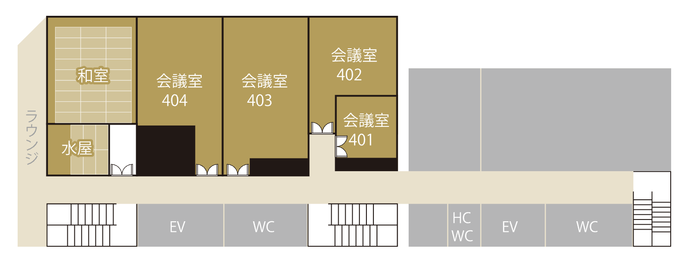

# Wi-Fi情報

<!--  -->

- SSID: 
- PW:

 

- Xのハッシュタグ: **#イケブクロ電脳組**
- 「池袋きたよ〜」を是非ポストしてください
---

<!-- _class: cover -->

---

# 会場のご案内

- トイレは404会議室を出てエレベーター近くにあります
- 会議室内で飲食は可能です

---

# 諸注意

## 入場・退場ご自由にどうぞ

---

---

# 自己紹介

## 梶原 睦 / かじはら むつみ

- 株式会社 シスマック
  DX ソリューション事業部 部長

- Twitter（現 X）: [@Mutsumix_dev](https://x.com/Mutsumix_dev)
- Voicy: [Mutsumix の進捗どう？](https://voicy.jp/channel/818315)
- 技術書典: [自宅水耕栽培で毎日サラダ生活](https://techbookfest.org/organization/dZMXNJTxsAx1K1pwDsU0iA)
- 最近は受託開発の提案やったり営業やったり研修講師やったり総務やったり

---

# 本日の流れ

- 18:00 開場
- 18:15 オープニング
- 18:30 もくもく開始
- 19:30 成果共有
- 19:45 LT① 
- 19:55 クロージング
- 20:00 終了

---

# このイベントの主旨

##  「技術系のイベント、池袋に少なくない？」

と思ったのをきっかけに、立ち上げたイベントです。
もくもく会をきっかけに、池袋を盛り上げていこうとしています🦉
とはいえ、肩の力を抜いて、本日はそれぞれの作業に黙々と集中していきましょう。